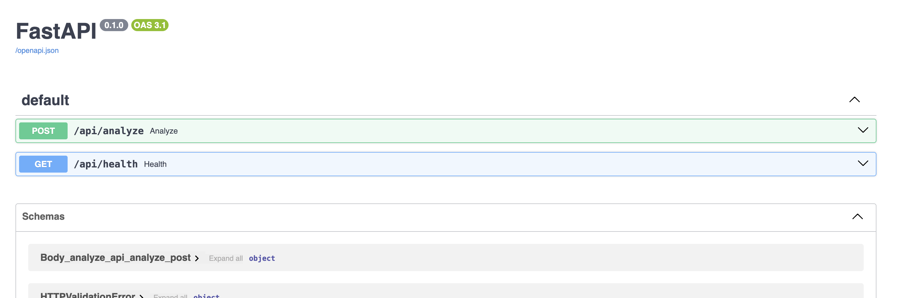
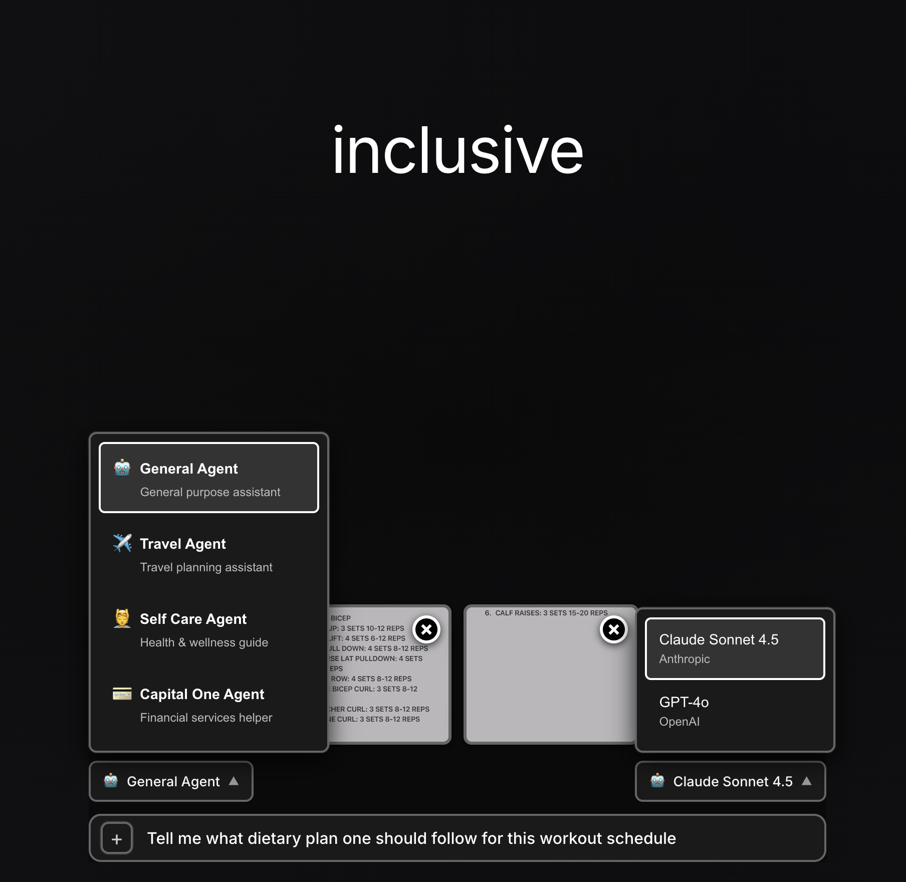

# ROMA-VLM: Multimodal Vision Extension for ROMA

This project extends the ROMA (Recursive Open Meta-Agents) framework with Vision Language Model (VLM) capabilities, allowing each node (Atomizer, Planner, Executor, Aggregator, Verifier) to process both text and images.


# 🎯 Features

- **VLM-Powered Nodes**: Every ROMA node can accept images as inputs
- **Different VLMs per Node**: Configure different vision models for each agent
- **Configurable Prediction Strategies**: Use Chain of Thought, ReAct, or CodeAct for each node
- **Signature Instructions**: Customize agent behavior with domain-specific prompts (NEW!)
- **Few-Shot Learning**: Add demos for improved vision analysis accuracy (NEW!)
- **Recursive Image Processing**: Images flow through the task hierarchy
- **Zero ROMA Modifications**: Uses ROMA as a library, no core changes needed
- **Drop-in Replacement**: Compatible with existing ROMA workflows
- **Agentic Memory**: You can read more about it [here](https://www.youtube.com/watch?v=n4GPdsQnHqc)


# 🚀 Installation

```bash
# Create venv
python3 -m venv vlm-roma-env
source vlm-roma-env/bin/activate  # This is for macOS/Linux but for windows use roma-vlm\Scripts\activate 
pip install -r requirements.txt # install all the dependences

# now we need to install ROMA into this environment and hence use following
cd ..
git clone https://github.com/sentient-agi/ROMA.git
cd ../ROMA
pip install -e .
cd ../MLHTechnicia
pip install -e . # downloading roma-vlm into our env so that we can import it anywhere easily
```


# 📦 Project Structure

```
roma-vlm-extension/
├── roma_vlm/
│   ├── signatures/          # Multimodal signatures extending ROMA
│   ├── modules/             # VLM-enabled modules (Atomizer, Planner, etc.)
│   ├── engine/              # Multimodal solve() function
│   ├── config/              # VLM-specific configuration
│   └── utils/               # Image handling utilities
├── examples/                # Usage examples
├── tests/                   # Test suite
├── config/                  # YAML configuration profiles
└── pyproject.toml
```


# Rest APIs
Start the Backend API Server
```bash
cd /Users/sarveshkhetan/src/MLHTechnicia
python api_server.py
```
This starts the FastAPI server on `http://localhost:8080`




# UI
```bash
cd /Users/sarveshkhetan/src/MLHTechnicia/frontend
npm install
npm run dev
```
This starts the React app on `http://localhost:3000`

